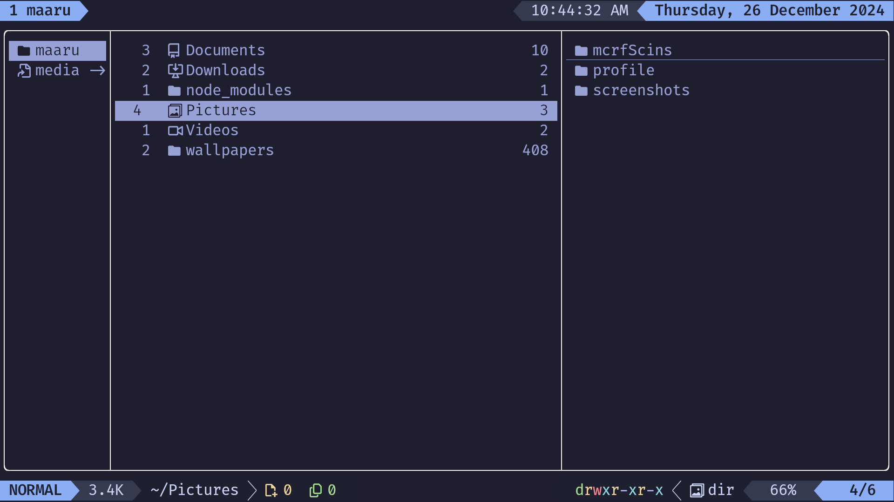

<!-- ██████╗ ███████╗ █████╗ ██████╗ ███╗   ███╗███████╗   ███╗   ███╗██████╗ -->
<!-- ██╔══██╗██╔════╝██╔══██╗██╔══██╗████╗ ████║██╔════╝   ████╗ ████║██╔══██╗ -->
<!-- ██████╔╝█████╗  ███████║██║  ██║██╔████╔██║█████╗     ██╔████╔██║██║  ██║ -->
<!-- ██╔══██╗██╔══╝  ██╔══██║██║  ██║██║╚██╔╝██║██╔══╝     ██║╚██╔╝██║██║  ██║ -->
<!-- ██║  ██║███████╗██║  ██║██████╔╝██║ ╚═╝ ██║███████╗██╗██║ ╚═╝ ██║██████╔╝ -->
<!-- ╚═╝  ╚═╝╚══════╝╚═╝  ╚═╝╚═════╝ ╚═╝     ╚═╝╚══════╝╚═╝╚═╝     ╚═╝╚═════╝ -->



[yazi](https://github.com/sxyazi/yazi)

## Plugins

- [chmod.yazi](https://github.com/dangooddd/yazi-plugins/tree/main/chmod.yazi)
- [full-border.yazi](https://github.com/dangooddd/yazi-plugins/tree/main/full-border.yazi)
- [git.yazi](https://github.com/yazi-rs/plugins/tree/main/git.yazi)
- [hide-preview.yazi](https://github.com/dangooddd/yazi-plugins/tree/main/hide-preview.yazi)
- [jump-to-char.yazi](https://github.com/yazi-rs/plugins/tree/main/jump-to-char.yazi)
- [open-with-cmd.yazi](https://github.com/Ape/open-with-cmd.yazi)
- [ouch.yazi](https://github.com/ndtoan96/ouch.yazi)
- [smart-enter.yazi](https://github.com/yazi-rs/plugins/tree/main/smart-enter.yazi)
- [sudo.yazi](https://github.com/TD-Sky/sudo.yazi)
- [video-ffmpeg.yazi](https://github.com/Tyarel8/video-ffmpeg.yazi)
- [yatline-catppuccin.yazi](https://github.com/imsi32/yatline-catppuccin.yazi)
- [yatline](https://github.com/imsi32/yatline.yazi)
- [relative-motions.yazi](https://github.com/dedukun/relative-motions.yazi)
- [max-preview.yazi](https://github.com/yazi-rs/plugins/tree/main/max-preview.yazi)
- [system-clipboard](https://github.com/orhnk/system-clipboard.yazi)

## Theme

- [catppuccin-mocha.yazi](https://github.com/catppuccin/yazi)

---

# usage

### Install

```bash
# Clone repository
mv ~/.config/yazi/ ~/.config/yazi-save
git clone https://github.com/maarutan/yazi-maaru.git ~/.config/yazi
cd ~/.config/yazi

# Install
./install.sh
```

---

# QA

## Additional Requirements

You must install the following dependencies:

- [ouch](https://github.com/ouch-org/ouch)
- [ffmpeg](https://ffmpeg.org)
- [zoxide](https://github.com/ajeetdsouza/zoxide)
- [fzf](https://github.com/junegunn/fzf)
- [ClipBoard](https://github.com/Slackadays/ClipBoard)
