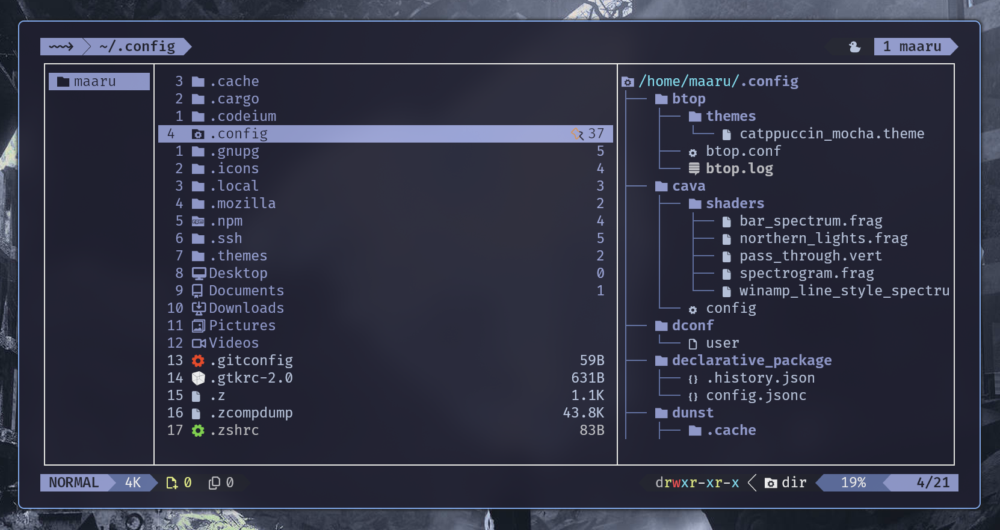

<h1 align="center">yamoon</h1>

<table>
  <tr>
    <td></td>
    <td>
      <strong>Yamoon</strong> — Cunstom Build <a href="https://github.com/sxyazi/yazi">Yazi</a><br/>
      build includes many popular plugins <br/>
      and a nice configuration structure for the gas  <br/>
      which gives you an easy way to interact with the configuration. 
    </td>
  </tr>
</table>

#### links

[~> Installation](#installation) <br />
[~> Example](#example) <br />
[~> Dependencies](#Dependencies) <br />
<br />
[~> plugins](package.toml)<br />

---

## Dependencies

`ouch` — for compressing and extracting files. <br />
`mediainfo` — for retrieving information about multimedia files (images, videos), including their preview. <br />
`trash-cli` — for restoring deleted files or directories, allowing undo of deletions. <br />
`git` — for viewing the state of a Git repository and managing versions. <br />
`ClipBoard` — for working with the clipboard in X11. <br />
`wl-clipboard` — for working with the clipboard in Wayland. <br />
`eza` — for displaying the file structure as a tree, an enhanced version of the `ls` command. <br />

## Example



## Installation

> ( Yamoon its just build yazi plugs ) requires [Yazi](https://github.com/sxyazi/yazi) to be installed on your system.

### 1. Curl install.sh

```bash
sh -c "$(curl -fsSL https://raw.githubusercontent.com/maarutan/yamoon/main/install.sh)"
```

### 2. Clone the repository

```bash
mv ~/.config/yazi ~/.config/yazi_"$(date +"%Y-%m-%d-%s")".bak
git clone https://github.com/maarutan/yamoon.git ~/.config/yazi/
sh ~/.config/yazi/install.sh --nobackup
```
